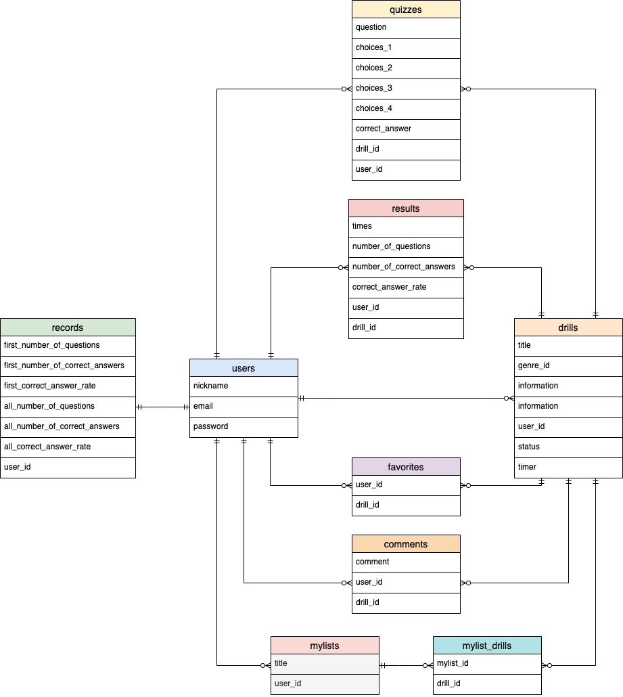
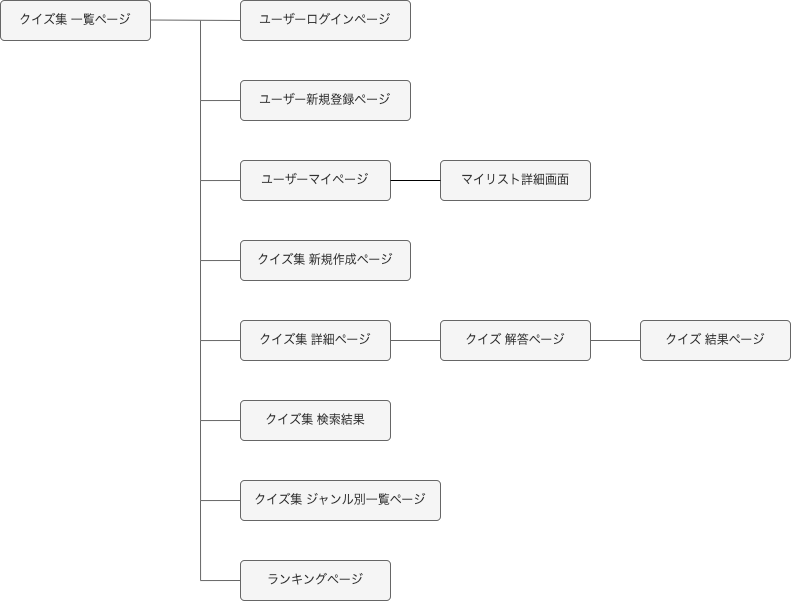

# アプリケーション名
Now The Question

# アプリケーション概要
ユーザー同士でクイズを出し合い、楽しむことができる。  
正解率やいいね獲得数のランキングで競い合うことができる。

# URL
https://now-the-question.herokuapp.com/

# テスト用アカウント
- Basic認証パスワード：2222
- Basic認証ID：admin
- メールアドレス：
- パスワード：

# 利用方法
## クイズ集新規作成
1. トップページ（クイズ集一覧ページ）のヘッダーからユーザー新規登録またはログインを行う
2. トップページのヘッダーの「クイズ集を作成」ボタンからクイズ集作成画面へ遷移する
3. タイトル、ジャンル、詳細説明を入力し、新規作成を押す

## クイズ追加・編集・削除
1. 作成したクイズ集の詳細画面（新規作成時は自動で遷移）の「次のクイズを追加する」の問題文、選択肢１、選択肢２、選択肢３、選択肢４、正解を入力しクイズを追加を押す
2. クイズの編集が必要な場合は、編集したいクイズの欄内の編集を押す
3. 問題文、選択肢１、選択肢２、選択肢３、選択肢４、正解のうち必要な箇所を編集し、更新するを押す
4. クイズの削除が必要な場合は、削除したいクイズの欄内の削除を押す
5. 確認ダイアログが出るので、OKを押すと削除され、キャンセルを押すと削除がキャンセルされる

## クイズを解く
1. 他のユーザーが作成したクイズ集のタイトルをクリックし詳細画面へ遷移する
2. 「クイズに挑戦」ボタンを押す
3. 各クイズの選択肢をクリックして解答して、最後に解答終了ボタンを押す
4. 結果表示画面に遷移し、挑戦回数、正回数、正解率が表示される
5. クイズ集が気に入ったらいいねボタンを押していいねができる（再度押すといいねを解除できる）
6. コメント欄のテキストを入力し、送信ボタンを押すとコメントできる（コメント投稿者のみ削除が可能）
7. 「正解を確認する」をクリックするとクイズの正解が表示される

# アプリケーションを作成した背景
クイズが好きな人が、自作のクイズを公開して他ユーザーに解いてもらう。逆に、他ユーザーが公開したクイズを自分が解くことで、友人と問題を出し合う感覚をオンライン上で手軽に味合い楽しむことができるように、クイズ投稿アプリケーションを開発した。  
また、将来的には学習アプリケーションを開発することを目指しており、その練習として「問題に解答する」というコンセプトからクイズという題材を選んだ。

# 洗い出した要件
https://docs.google.com/spreadsheets/d/1FjFZSAV6R4gZJtOmv5wjZROX9nFLqSOOxDfVZASlBpI/edit?usp=sharing

# 実装した機能についての画像やGIFおよびその説明
## クイズ集新規作成・クイズ追加

# 実装予定機能
現在、マイリスト機能を実装中。  
今後はタイマー機能を実装予定。

# データベース設計

# 画面遷移図

# 開発環境
- Ruby on Rails
- Ruby
- HTML･CSS
- JavaScript
- Visual Studio Code
- Heroku

# ローカルでの動作方法
以下のコマンドを順に実行  
% git clone https://github.com/yun814/now_the_question  
% cd now_the_question  
% bundle install  
% yarn install

# 工夫したポイント
